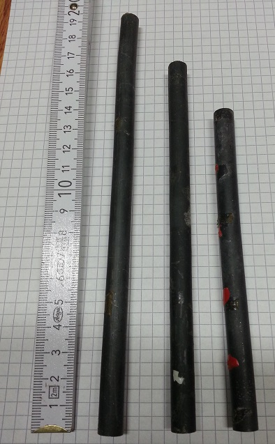
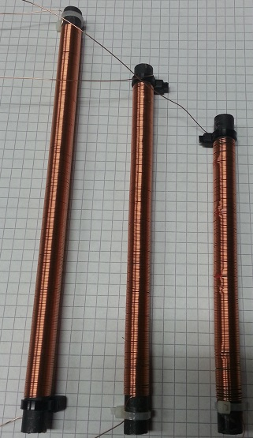
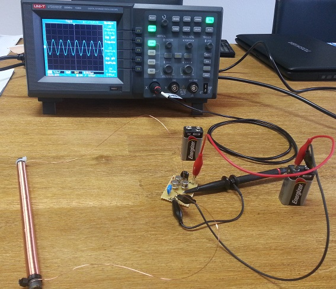
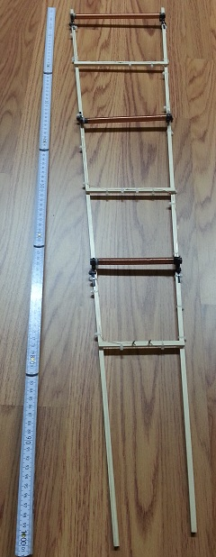
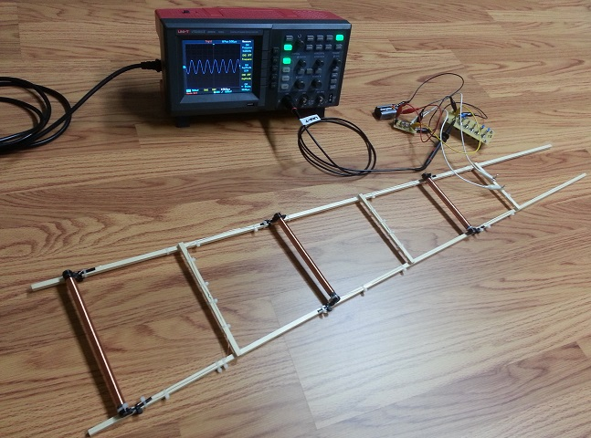

# ferrite-ant-test
Test of three ferrite antennas for receiving very low frequency (VLF) signals.

## Overview of ferrite rods
The ferrite rods have been recycled from old radios. The material and frequency range
is unfortunately unknown.

Ferrite rod | Length (cm) | Diameter (cm)
---|-------------|-------
Fer-A | 20 | 1
Fer-B | 16.5 | 1
Fer-C | 14 | 1

## Ferrite rods with windings

Ferrite rod | Windings
---|-------------
Fer-A | TODO
Fer-B | TODO
Fer-C | TODO

## Measurement

## Ferrite antenna

## Ferrite antenna measurement

